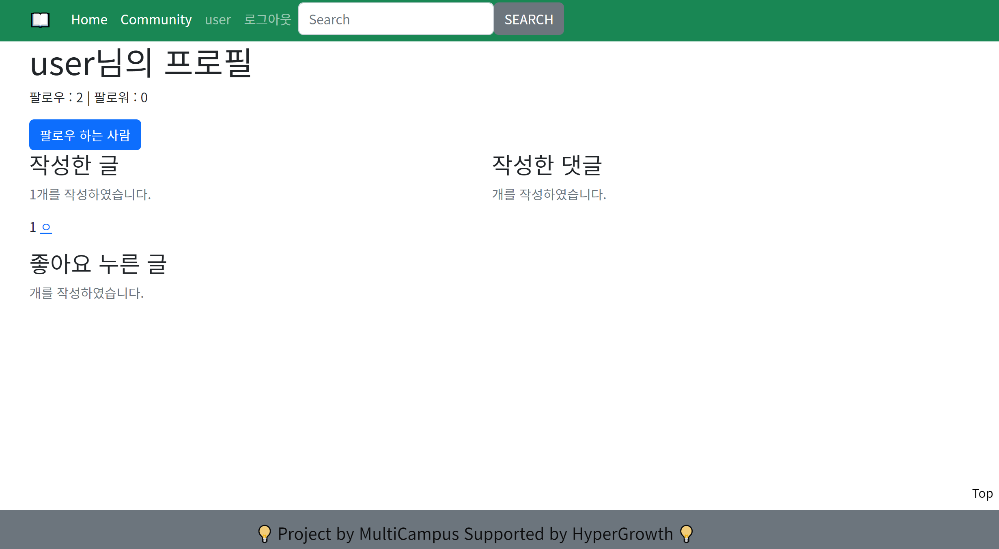
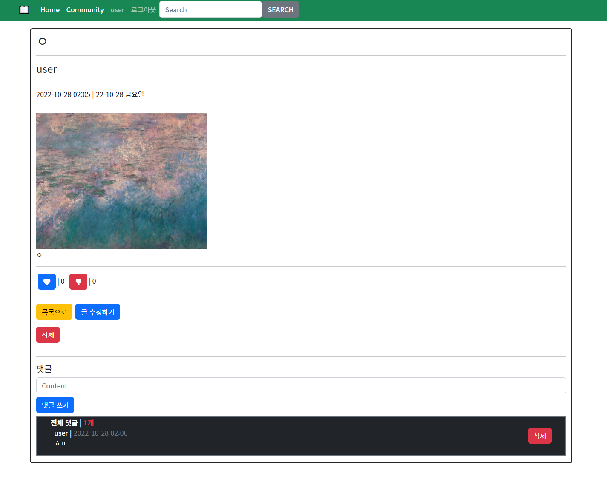
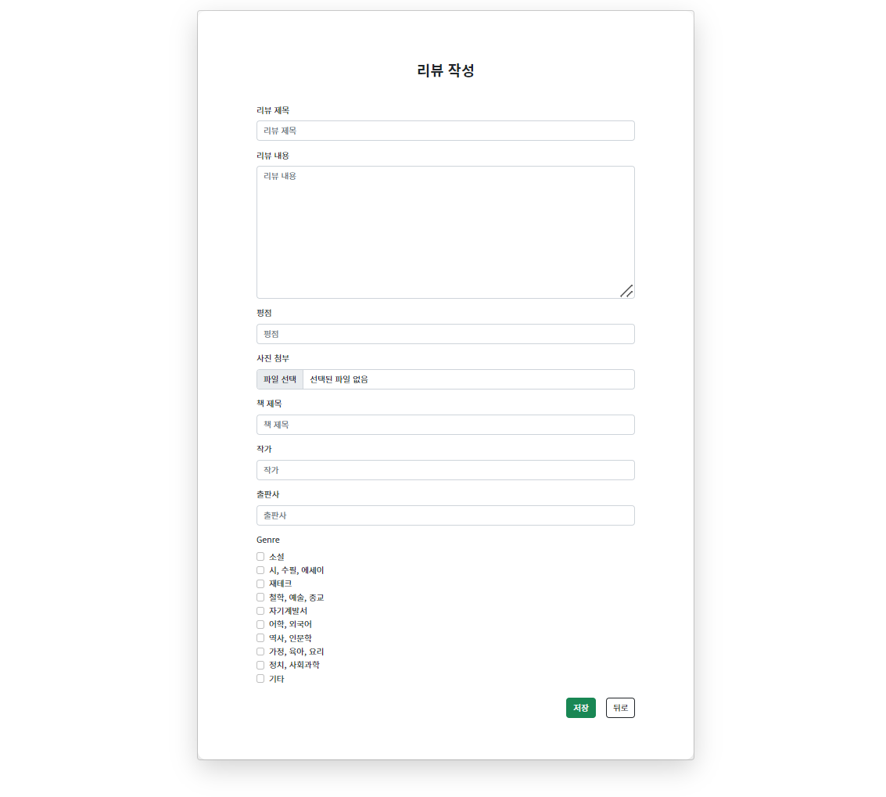
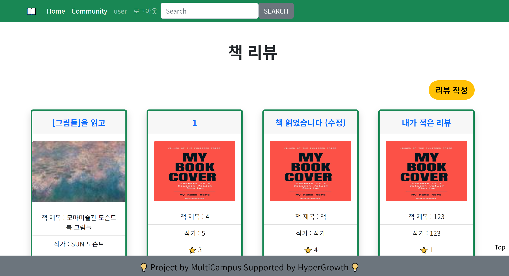
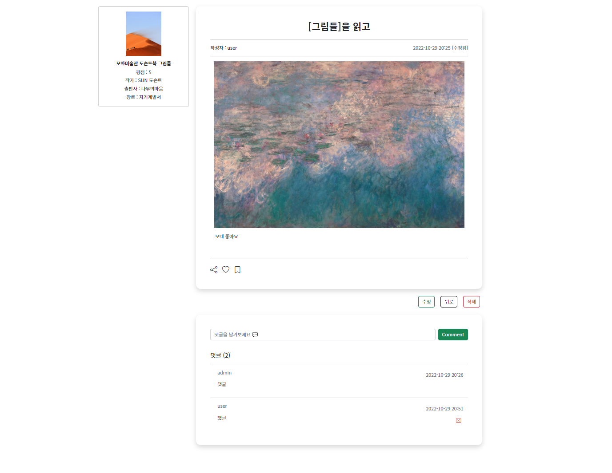

# 221027 Pair Project

> **책 리뷰, 게시판 사이트 구현**
>
> 강동현, 김교민, 임선주
>
> 기간 : 2022.10.27 - 2022.10.28

- [강동현](#📚-강동현)
- [김교민](#📚-김교민)
- 

 

## 📚 강동현

### 📖 담당 파트

* 프로젝트 초기설정
* 계정(`accounts`)앱 관련 회원관리기능
* navbar, footer
* static 경로설정
* 검색기능

 

### 📖  느낀점 / 배운점

* 2일에 걸친 프로젝트는 처음이라 초반엔 더 막막했던 것 같았다.
* 아무래도 얼마나 내용이 많으면 2일이나 시간을 줄까하면서 겁을 많이 먹었었다.
* 하지만 그동안 반복하던 내용의 반복에 약간의 비동기 서버를 통한 배포 정도만 있어서 그렇게 어렵지는 않은 것 같다.
* 오히려 주어진 내용을 다하게 되자 기능적으로 구현하고 싶었던 것들을 구글링을 통해 검색하게되어서 도움이 많이 된 듯 하다.
* 역시 디자인쪽은 나와 맞지 않는다. 분명히 색감이 거슬리고 이상하지만 도저히 더 좋은 색조합, 모양의 형태, 태그의 위치를 찾을 수가 없었다. 특히 아래 top버튼과 navbar의 검색창 위치에서 이걸 많이 느꼈다.
* 프론트든 백이든 창조적이어야 할텐데 이건 좀 걱정이 된다.
* 자신감 += 기능구현을 해보면서 얻은 자신감
* 자신감 -= 디자인구현과정에서 사라진 자신감
* 원점이네???

---

## 📚 김교민

### 📖 담당 파트

* articles 앱
* reviews 와 비슷하면서 리뷰 목적이 아닌 자유게시판으로서의 역할
* 게시글 작성/편집에 이미지 파일 업로드 구현
* index에 게시글 목록section 과 user section을 분리배치하여 커뮤니티의 기본적인 부분을 구현

 

### 📖 느낀점/배운점

* 이틀에 걸친 프로젝트를 진행 하기 전에 금방 할 수 있을 것 같다는 느낌과 이틀로는 가능할까라는 느낌이 겹쳤는데
* 막상 진행하니까 괜한 걱정이었다는 생각이 들었고
* 진행하면서 push/merge 할 때 극초반을 제외하고 충돌없이 진행해서 좋았다.
* 리뷰와는 다른 자유게시판 개념의 커뮤니티 페이지를 제안했고 직접 만들게 되었는데
* 그동안 배운게 많이 도움이 되어서 오타나거나 뭔가 빼먹어서 오류난 거 빼면
* 어렵지 않게 완성시킬 수 있었다.
* 오류가 나서 원인을 찾다 보면 오타를 냈거나 글자 하나 빼먹은 경우가 실습 했을 때도 있었는데
* 작성할 때 좀 주의깊게 작성해보도록 노력해야 겠다는 생각이 들었다.

---

## 📚 임선주

### 📖 담당 파트 : Reviews App

#### review create 페이지

- 글의 제목과 내용, 평점, 이미지 첨부(선택사항)
- 책의 제목과 작가, 출판사, 장르(최소 1개, 최대 3개까지 다중 선택 - `MultiselectField`)
- 저장, 뒤로가기 버튼
- 리뷰 작성 완료시 `리뷰 작성 완료!`라는 메시지 출력

 

#### review index 페이지

- 작성된 리뷰들의 목록
- 리뷰 제목과 썸네일, 책의 제목과 작가, 평점, 최근 수정 시간 표시
- 썸네일이 없는 리뷰는 기본 이미지 출력
- 리뷰 작성 버튼

 

#### review detail 페이지

- 리뷰의 상세 내용 확인 가능
  - 제목, 작성자, 작성시간, 내용
  - 수정할 경우, 작성시간이 수정시간으로 변경되고 옆에 `(수정됨)`이라 표시
  - 공유, 좋아요, 스크랩 아이콘 (좋아요 기능만 구현)

- 작성자에게는 수정, 뒤로가기, 삭제 버튼이 보여지고 작성자가 아니라면 뒤로가기 버튼만 보여짐
- 리뷰 수정 완료시 `리뷰 수정 완료!`라는 메시지 출력
- 리뷰 삭제 완료시 `리뷰 삭제 완료!`라는 메시지 출력
- 댓글 작성 및 댓글의 개수, 목록 확인 가능
- 댓글 작성자와 내용, 작성시간 확인 가능
- 리뷰 왼쪽에서 책 정보 확인 가능

 

### 📖 느낀점 / 배운점

- 이전(하루)에 비해 이틀이라는 시간이 주어져서 생각보다 여유롭게 원했던 기능을 구현하고 디자인을 꾸며볼 수 있었다.
- 세 명의 팀원들이 각자 앱을 분리하여 진행했기 때문에 merge할 경우 conflict도 많이 발생하지 않았고, 각자 담당한 앱을 자신만의 스타일로 자유롭게 꾸며나갈 수 있었다.
- 지난 주 프로젝트에서 다른 팀원분이 구현했던 기능을 이번 프로젝트에서는 내가 직접 구현해볼 수 있어서 좋았다.
- 아직 원하는 기능들은 많지만, 다 구현해보지 못해서 아쉽다.
  - 다음 프로젝트에서 구현해보고싶은 것들
    - 반응형 이미지
    - top 버튼
    - static / style.css 적용해보기
    - get_object_or_404
    - hover
    - pagination
    - aside bar가 페이지를 스크롤할 때 같이 이동하게
    - 다양한 Django extension들 적용해보기
